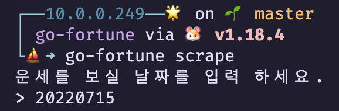

# GoFortune (오늘의 운세)
## 시작 하기

### 프로그램 설명

주어진 날짜의 운세를 *YTN 오늘의 운세* 사이트에서 스크랩 합니다.

원하는 날짜를 입력할 수 있습니다.
```bash
운세를 보실 날짜를 입력 하세요.
> 20220715
```
스크래핑 중에는 "운세를 읽는 중... 기다려 주세요." 메세지가 화면에 표시 됩니다.

프로그램을 종료 하려면, *Ctrl+c* 키를 누르세요.
프로그램의 종료 없이 다른 날짜를 입력 하려면, *esc* 키를 누르세요.


### 실행 하기

**fortune_sample.yml** 파일을 참조하여, **fortune_config.yml** 파일을 만든 후에,
**$HOME/go-workspace/bin** 폴더 (1) 또는 현재 작업 폴더 (2) 에 복사를 합니다.
(1) 의 위치가 우선 순위를 갖습니다.

*base 설정 값은 소스를 참조하여 유추하시기 바랍니다.*

설치된 **Go** 명령어를 사용하여 다음과 같이 실행 합니다.

```bash
go run main.go scrape
```

또는, **Taskfile**을 설치하여 **go-fortune** 명령을 설치하여 실행할 수도 있습니다.
이 경우에는 **fortune_config.yml**"이 있는 폴더에서 실행을 하거나, 그 설정 파일을
**$HOME/go-workspace/bin** 폴더에 복사를 한 후에 실행을 하세요.

```bash
task install
go-fortune scrape
```



[TaskFile](https://taskfile.dev/)
